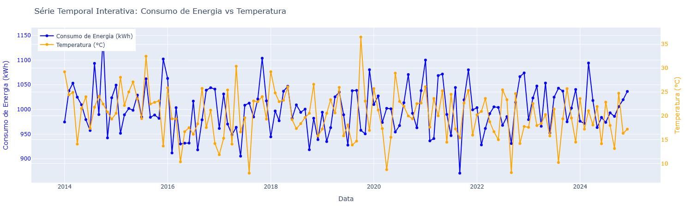
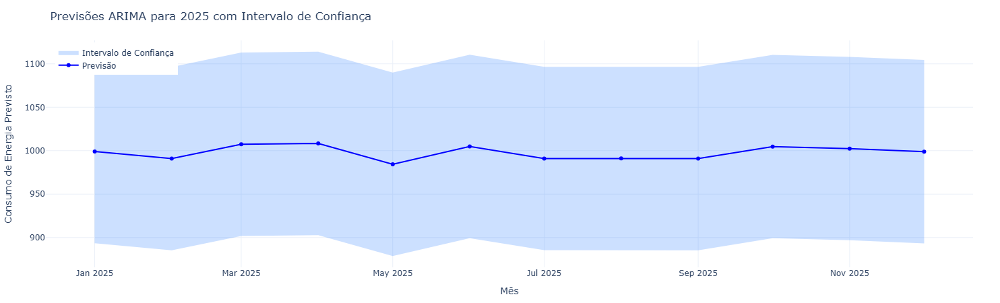

# 🔌 Energy Consumption Time Series Forecasting

Este projeto visa analisar e prever o **consumo de energia elétrica** com base em séries temporais multivariadas. A abordagem combina modelagem estatística clássica com algoritmos de aprendizado de máquina, explorando variáveis exógenas como **temperatura** para melhorar a precisão das previsões.

---

## ⚙️ Objetivos

- Análise exploratória da série temporal de consumo de energia
- Identificação de padrões sazonais e tendências
- Construção de modelos de previsão: SARIMAX
- Avaliação de desempenho com métricas robustas (MAE, MSE, RMSE)
- Visualizações interativas e painéis analíticos para comunicação dos resultados utilizando Plotly
- Previsão do consumo para os 12 meses de **2025**, com intervalos de confiança


---

## 🧰 Principais Bibliotecas Utilizadas

| Categoria                 | Bibliotecas                  |
|--------------------------|------------------------------|
| Manipulação de Dados     | `pandas`, `numpy`            |
| Séries Temporais         | `statsmodels`, `pmdarima`    |
| Aprendizado de Máquina   | `sarimax`, `scikit-learn`    |
| Visualização             | `matplotlib`, `seaborn`, `plotly` |
| Utilitários              | `datetime`, `warnings`       |

---

## 🧪 Modelos Utilizados

### 🔹 SARIMAX
- Identificação automática dos parâmetros (p, d, q)
- Utilização de variáveis exógenas (`exog`) como **temperatura**
- Geração de previsões com intervalo de confiança para 2025


## 📊 Visualizações Geradas

- **Valores reais vs previstos** (linha)
- **Previsão vs real** (scatter + linha y=x)
- **Gráfico interativo** das previsões de 2025 com `Plotly`, incluindo faixa de confiança (IC 95%)

---

## 📈 Resultados

- MAE médio: **≈ 32 kWh**
- RMSE médio: **≈ 49 kWh**
- Resíduos distribuídos de forma quase normal, sem autocorrelação significativa
- Gráficos mostram boa aderência entre previsão e valores reais, especialmente em períodos com padrão sazonal
  


---

## 📅 Previsão para 2025

A previsão para os próximos 12 meses foi gerada com `auto_arima` + variáveis exógenas. O gráfico apresenta:

- Linha de previsão (jan a dez de 2025)
- Banda de confiança (IC 95%)
- Ponto de maior consumo destacado
- Estimativa de consumo médio anual

---

## 💻 Como Executar

```bash
# Clonar o repositório
git clone https://github.com/jaquelinesfernandes/Energy_Consumption_TimesSeriesS.git
cd Energy_Consumption_TimesSeriesS

# Instalar dependências
pip install -r requirements.txt

# Abrir notebooks
jupyter notebook notebooks/
